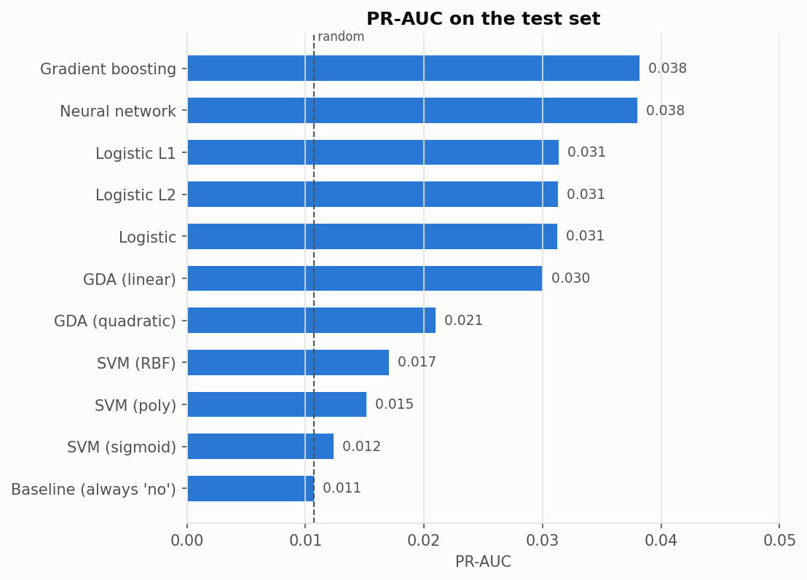
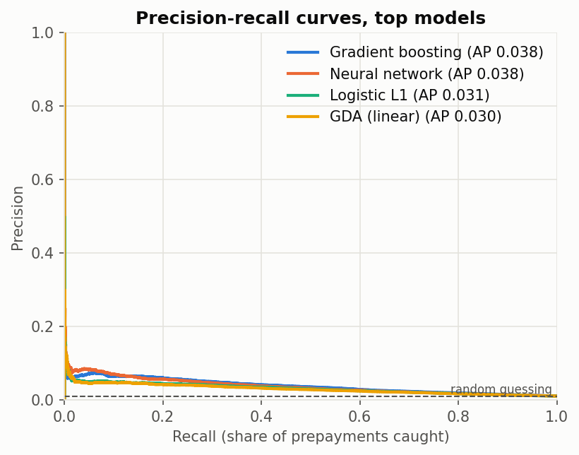
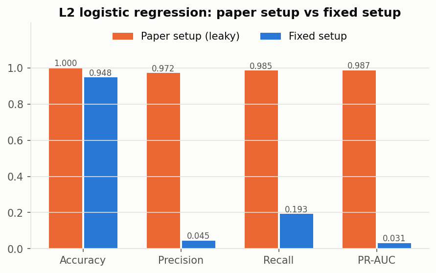
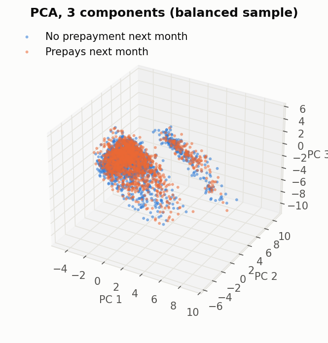
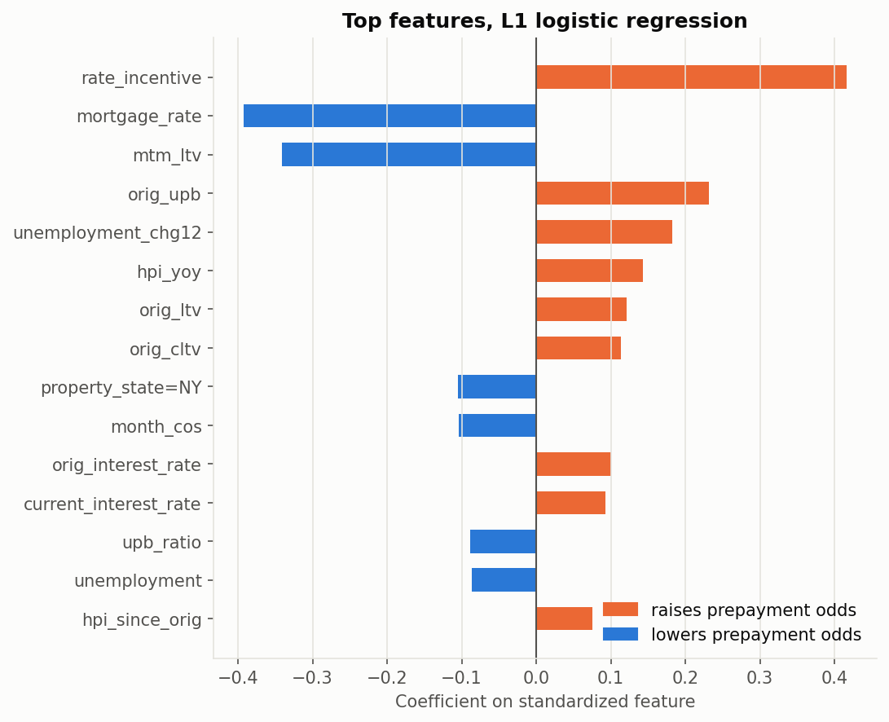

# Results

_Generated 2026-09-30 19:48 by `python run_all.py`._

## Data

- Vintages: 2012, 2014, 2016, 2018, 2020, 2022
- Loans: 29,982  |  loan-months: 1,722,603  |  features: 104
- Monthly prepayment rate: 1.08% (so always answering 'no prepayment' is already 98.93% accurate on test)
- Split: **loan**, train / val / test rows = 1,031,599 / 344,513 / 346,491
- Decision threshold for each model: the one with the best F1 on the validation set.

## Test-set performance

| Model | Accuracy | Precision | Recall | F1 | PR-AUC | ROC-AUC | True no-prepay | True prepay | Fit (s) |
|---|---|---|---|---|---|---|---|---|---|
| Gradient boosting | 96.11% | 0.062 | 0.185 | 0.093 | **0.038** | 0.756 | 96.95% | 18.54% | 57.8 |
| Neural network | 96.96% | 0.064 | 0.135 | 0.087 | **0.038** | 0.739 | 97.86% | 13.55% | 353.2 |
| Logistic L1 | 94.80% | 0.046 | 0.193 | 0.074 | **0.031** | 0.727 | 95.62% | 19.33% | 34.6 |
| Logistic L2 | 94.77% | 0.045 | 0.193 | 0.073 | **0.031** | 0.727 | 95.58% | 19.27% | 7.1 |
| Logistic | 94.79% | 0.045 | 0.192 | 0.073 | **0.031** | 0.727 | 95.61% | 19.19% | 8.5 |
| GDA (linear) | 93.96% | 0.041 | 0.210 | 0.069 | **0.030** | 0.721 | 94.75% | 21.03% | 14.8 |
| GDA (quadratic) | 92.14% | 0.030 | 0.200 | 0.052 | **0.021** | 0.660 | 92.92% | 20.00% | 68.1 |
| SVM (RBF) | 90.37% | 0.021 | 0.177 | 0.038 | **0.017** | 0.609 | 91.16% | 17.65% | 5.4 |
| SVM (poly) | 89.60% | 0.019 | 0.176 | 0.035 | **0.015** | 0.576 | 90.38% | 17.57% | 3.3 |
| SVM (sigmoid) | 90.63% | 0.014 | 0.113 | 0.025 | **0.012** | 0.544 | 91.49% | 11.26% | 0.9 |
| Baseline (always 'no') | 98.93% | 0.000 | 0.000 | 0.000 | **0.011** | 0.500 | 100.00% | 0.00% | 0.2 |

Sorted by PR-AUC (area under the precision-recall curve), the most informative single number when the positive class is rare. "True no-prepay" and "True prepay" are the paper's Table 1 columns (specificity and recall).

## Leakage check: paper setup vs fixed setup

Same model (L2 logistic regression), same loans. The paper setup labels each row "prepaid this month", keeps the payoff row (where the balance is already 0) and splits rows at random.

| Setup | Accuracy | Precision | Recall | PR-AUC |
|---|---|---|---|---|
| Paper (leaky) | 99.95% | 0.972 | 0.985 | 0.987 |
| Fixed | 94.77% | 0.045 | 0.193 | 0.031 |

## Other figures

- `figures/confusion_<model>.png` - confusion matrix per model (test set)
- `figures/pca_3d.png` - 3-component PCA of the training features
- `figures/top_features.png` - largest L1 logistic regression coefficients
- `figures/roc_auc.png` - ROC-AUC per model

